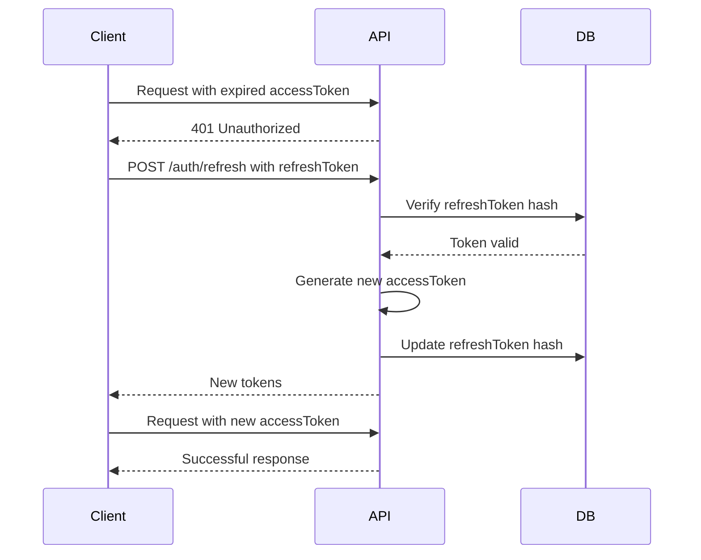

## Authentication System

### Authentication Strategies

| Strategy         | Description       | Provider |
| ---------------- | ----------------- | -------- |
| **Local**        | Email + Password  | LOCAL    |
| **Google OAuth** | Login with Google | GOOGLE   |

### JWT Token Flow

```typescript
// Access Token (15 min expiration)
{
  sub: userId,
  email: user.email,
  role: user.role,
  iat: timestamp,
  exp: timestamp + 15min
}

// Refresh Token (7 days expiration)
{
  sub: userId,
  type: 'refresh',
  iat: timestamp,
  exp: timestamp + 7days
}
```

### Refresh Token Flow



### Authorization Guards

| Guard             | Purpose              |
| ----------------- | -------------------- |
| `JwtAuthGuard`    | Validates JWT token  |
| `RolesGuard`      | Verifies user role   |
| `GoogleAuthGuard` | Handles Google OAuth |

### Custom Decorators

```typescript
// Get user from request
@GetUser() user: User
@GetUser('id') userId: string

// Define allowed roles
@Roles(UserRole.ADMIN, UserRole.SELLER)

// Mark endpoint as public
@Public()
```
