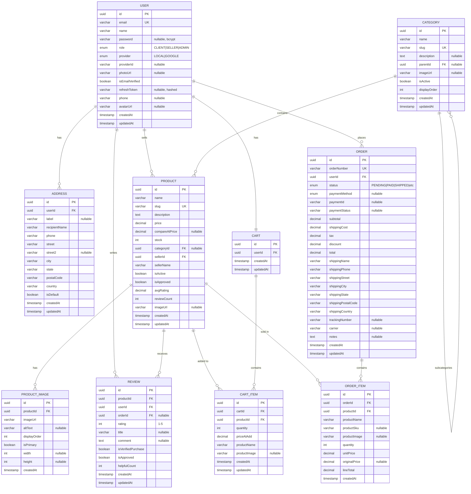

```mermaid
erDiagram
    USER ||--o{ ADDRESS : "has"
    USER ||--o{ PRODUCT : "sells"
    USER ||--o{ ORDER : "places"
    USER ||--o{ REVIEW : "writes"
    USER ||--|| CART : "has"

    USER {
        uuid id PK
        varchar email UK
        varchar name
        varchar password "nullable, bcrypt"
        enum role "CLIENT|SELLER|ADMIN"
        enum provider "LOCAL|GOOGLE"
        varchar providerId "nullable"
        varchar photoUrl "nullable"
        boolean isEmailVerified
        varchar refreshToken "nullable, hashed"
        varchar phone "nullable"
        varchar avatarUrl "nullable"
        timestamp createdAt
        timestamp updatedAt
    }

    ADDRESS {
        uuid id PK
        uuid userId FK
        varchar label "nullable"
        varchar recipientName
        varchar phone
        varchar street
        varchar street2 "nullable"
        varchar city
        varchar state
        varchar postalCode
        varchar country
        boolean isDefault
        timestamp createdAt
        timestamp updatedAt
    }

    CATEGORY ||--o{ PRODUCT : "contains"
    CATEGORY ||--o{ CATEGORY : "subcategories"
    PRODUCT ||--o{ PRODUCT_IMAGE : "has"
    PRODUCT ||--o{ REVIEW : "receives"
    PRODUCT ||--o{ CART_ITEM : "added to"
    PRODUCT ||--o{ ORDER_ITEM : "sold in"

    CATEGORY {
        uuid id PK
        varchar name
        varchar slug UK
        text description "nullable"
        uuid parentId FK "nullable"
        varchar imageUrl "nullable"
        boolean isActive
        int displayOrder
        timestamp createdAt
        timestamp updatedAt
    }

    PRODUCT {
        uuid id PK
        varchar name
        varchar slug UK
        text description
        decimal price
        decimal compareAtPrice "nullable"
        int stock
        uuid categoryId FK "nullable"
        uuid sellerId FK
        varchar sellerName
        boolean isActive
        boolean isApproved
        decimal avgRating
        int reviewCount
        varchar imageUrl "nullable"
        timestamp createdAt
        timestamp updatedAt
    }

    PRODUCT_IMAGE {
        uuid id PK
        uuid productId FK
        varchar imageUrl
        varchar altText "nullable"
        int displayOrder
        boolean isPrimary
        int width "nullable"
        int height "nullable"
        timestamp createdAt
    }

    REVIEW {
        uuid id PK
        uuid productId FK
        uuid userId FK
        uuid orderId FK "nullable"
        int rating "1-5"
        varchar title "nullable"
        text comment "nullable"
        boolean isVerifiedPurchase
        boolean isApproved
        int helpfulCount
        timestamp createdAt
        timestamp updatedAt
    }

    CART ||--o{ CART_ITEM : "contains"

    CART {
        uuid id PK
        uuid userId FK
        timestamp createdAt
        timestamp updatedAt
    }

    CART_ITEM {
        uuid id PK
        uuid cartId FK
        uuid productId FK
        int quantity
        decimal priceAtAdd
        varchar productName
        varchar productImage "nullable"
        timestamp createdAt
        timestamp updatedAt
    }

    ORDER ||--o{ ORDER_ITEM : "contains"

    ORDER {
        uuid id PK
        varchar orderNumber UK
        uuid userId FK
        enum status "PENDING|PAID|SHIPPED|etc"
        enum paymentMethod "nullable"
        varchar paymentId "nullable"
        varchar paymentStatus "nullable"
        decimal subtotal
        decimal shippingCost
        decimal tax
        decimal discount
        decimal total
        varchar shippingName
        varchar shippingPhone
        varchar shippingStreet
        varchar shippingCity
        varchar shippingState
        varchar shippingPostalCode
        varchar shippingCountry
        varchar trackingNumber "nullable"
        varchar carrier "nullable"
        text notes "nullable"
        timestamp createdAt
        timestamp updatedAt
    }

    ORDER_ITEM {
        uuid id PK
        uuid orderId FK
        uuid productId FK
        varchar productName
        varchar productSku "nullable"
        varchar productImage "nullable"
        int quantity
        decimal unitPrice
        decimal originalPrice "nullable"
        decimal lineTotal
        timestamp createdAt
    }
```
