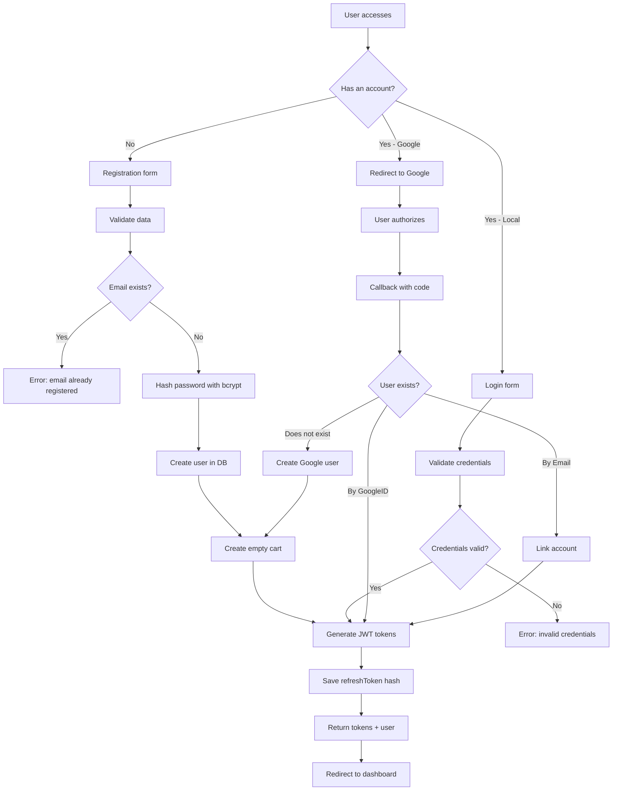
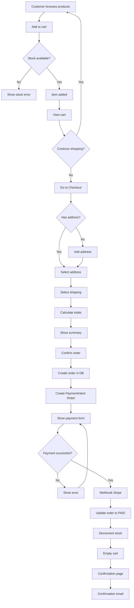
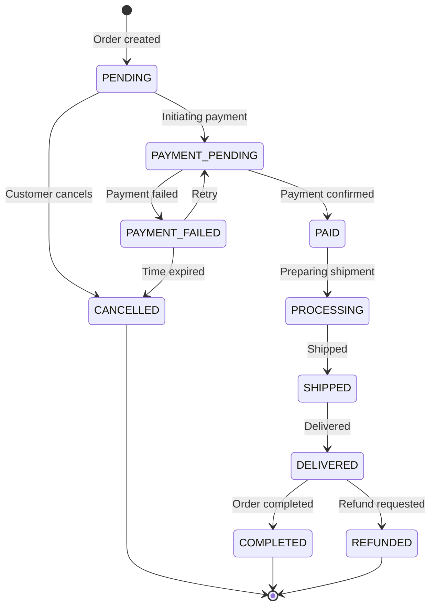
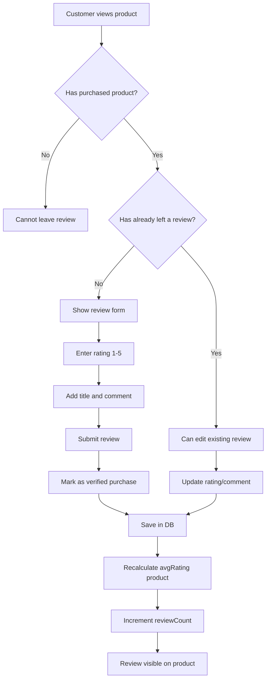

## System Flows

### Registration and Login Flow

```mermaid
flowchart TD
    A[User accesses] --> B{Has an account?}

    B -->|No| C[Registration form]
    C --> D[Validate data]
    D --> E{Email exists?}
    E -->|Yes| F[Error: email already registered]
    E -->|No| G[Hash password with bcrypt]
    G --> H[Create user in DB]
    H --> I[Create empty cart]
    I --> J[Generate JWT tokens]
    J --> K[Save refreshToken hash]
    K --> L[Return tokens + user]

    B -->|Yes - Local| M[Login form]
    M --> N[Validate credentials]
    N --> O{Credentials valid?}
    O -->|No| P[Error: invalid credentials]
    O -->|Yes| J

    B -->|Yes - Google| Q[Redirect to Google]
    Q --> R[User authorizes]
    R --> S[Callback with code]
    S --> T{User exists?}
    T -->|By GoogleID| J
    T -->|By Email| U[Link account]
    U --> J
    T -->|Does not exist| V[Create Google user]
    V --> I

    L --> W[Redirect to dashboard]
```

### Complete Purchase Flow

```mermaid
flowchart TD
    A[Customer browses products] --> B[Add to cart]
    B --> C{Stock available?}
    C -->|No| D[Show stock error]
    C -->|Yes| E[Item added]

    E --> F[View cart]
    F --> G{Continue shopping?}
    G -->|Yes| A
    G -->|No| H[Go to Checkout]

    H --> I{Has address?}
    I -->|No| J[Add address]
    I -->|Yes| K[Select address]
    J --> K

    K --> L[Select shipping]
    L --> M[Calculate totals]
    M --> N[Show summary]

    N --> O[Confirm order]
    O --> P[Create order in DB]
    P --> Q[Create PaymentIntent Stripe]
    Q --> R[Show payment form]

    R --> S{Payment successful?}
    S -->|No| T[Show error]
    T --> R

    S -->|Yes| U[Webhook Stripe]
    U --> V[Update order to PAID]
    V --> W[Decrement stock]
    W --> X[Empty cart]
    X --> Y[Confirmation page]
    Y --> Z[Confirmation email]
```

### Order States Flow

```mermaid
stateDiagram-v2
    [*] --> PENDING: Order created

    PENDING --> PAYMENT_PENDING: Initiating payment
    PENDING --> CANCELLED: Customer cancels

    PAYMENT_PENDING --> PAID: Payment confirmed
    PAYMENT_PENDING --> PAYMENT_FAILED: Payment failed

    PAYMENT_FAILED --> PAYMENT_PENDING: Retry
    PAYMENT_FAILED --> CANCELLED: Time expired

    PAID --> PROCESSING: Preparing shipment

    PROCESSING --> SHIPPED: Shipped

    SHIPPED --> DELIVERED: Delivered

    DELIVERED --> COMPLETED: Order completed
    DELIVERED --> REFUNDED: Refund requested

    CANCELLED --> [*]
    COMPLETED --> [*]
    REFUNDED --> [*]
```

### Reviews Flow

```mermaid
flowchart TD
    A[Customer views product] --> B{Has purchased product?}

    B -->|No| C[Cannot leave review]

    B -->|Yes| D{Has already left a review?}
    D -->|Yes| E[Can edit existing review]
    D -->|No| F[Show review form]

    F --> G[Enter rating 1-5]
    G --> H[Add title and comment]
    H --> I[Submit review]

    I --> J[Mark as verified purchase]
    J --> K[Save in DB]
    K --> L[Recalculate avgRating product]
    L --> M[Increment reviewCount]
    M --> N[Review visible on product]

    E --> O[Update rating/comment]
    O --> K
```
