# Use Cases

## System Actors

```mermaid
graph TB
    subgraph Actors
        V[👤 Visitor]
        C[🛒 Customer]
        S[🏪 Seller]
        A[👑 Administrator]
    end

    V -->|registers| C
    C -->|requests to become seller| S
    S -->|can be promoted to| A
```

### Visitor Use Cases

| ID     | Use Case             | Description                        |
| ------ | -------------------- | ---------------------------------- |
| CU-V01 | View catalog         | Browse products without login      |
| CU-V02 | Search products      | Search by name/description         |
| CU-V03 | Filter products      | By category, price, rating         |
| CU-V04 | View product details | Full information, images, reviews  |
| CU-V05 | View reviews         | Read reviews from other users      |
| CU-V06 | Register             | Create account with email/password |
| CU-V07 | Login                | Sign in locally or with Google     |

### Customer Use Cases

| ID     | Use Case            | Description                 |
| ------ | ------------------- | --------------------------- |
| CU-C01 | Edit profile        | Update personal information |
| CU-C02 | Change password     | Modify password             |
| CU-C03 | Manage addresses    | CRUD for shipping addresses |
| CU-C04 | Add to cart         | Add products                |
| CU-C05 | Modify cart         | Change quantities, remove   |
| CU-C06 | Checkout            | Purchase process            |
| CU-C07 | Pay with Stripe     | Complete payment            |
| CU-C08 | View order history  | List of purchases           |
| CU-C09 | View order details  | Status, tracking, items     |
| CU-C10 | Cancel order        | Only if pending             |
| CU-C11 | Write review        | Rating + comment            |
| CU-C12 | Edit review         | Modify my review            |
| CU-C13 | Mark review helpful | Vote on others' reviews     |

### Seller Use Cases

| ID     | Use Case         | Description             |
| ------ | ---------------- | ----------------------- |
| CU-S01 | Create product   | New product with images |
| CU-S02 | Edit product     | Modify information      |
| CU-S03 | Manage stock     | Update inventory        |
| CU-S04 | Upload images    | Product gallery         |
| CU-S05 | View my products | List of own products    |
| CU-S06 | View sales       | Orders of own products  |
| CU-S07 | View statistics  | Sales analytics         |
| CU-S08 | Dashboard        | Seller metrics          |

### Administrator Use Cases

| ID     | Use Case            | Description                      |
| ------ | ------------------- | -------------------------------- |
| CU-A01 | Global dashboard    | System metrics                   |
| CU-A02 | Manage users        | View, edit, delete, change roles |
| CU-A03 | Manage categories   | CRUD for categories              |
| CU-A04 | Approve products    | Moderate new products            |
| CU-A05 | Reject products     | Moderate products                |
| CU-A06 | View all orders     | Global supervision               |
| CU-A07 | Change order status | Update order status              |
| CU-A08 | Moderate reviews    | Remove inappropriate reviews     |
| CU-A09 | View activity       | Recent activity feed             |
| CU-A10 | Sales graphs        | Global sales analytics           |

---
